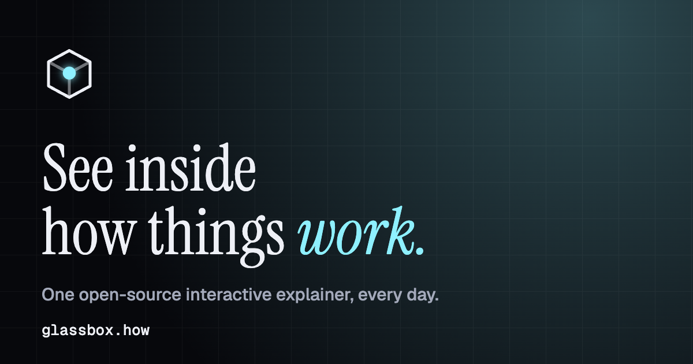
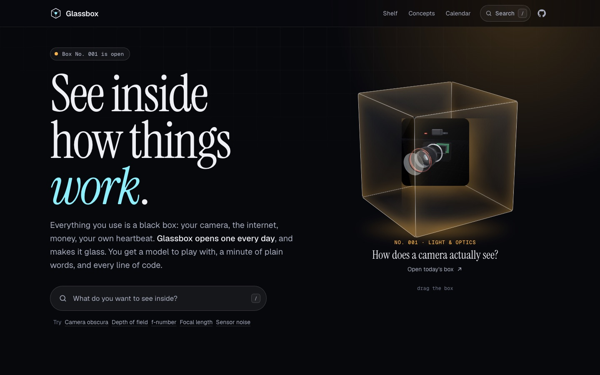
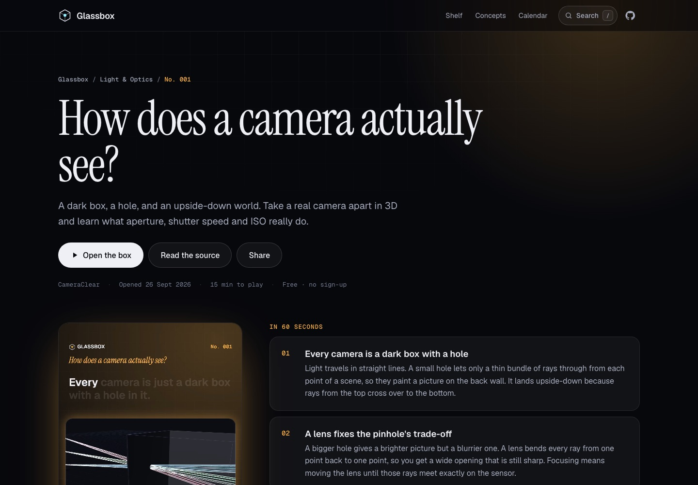
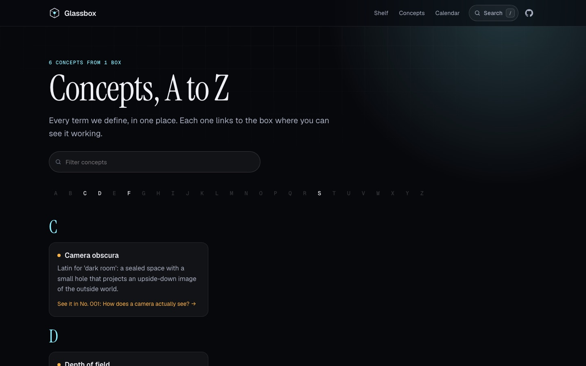
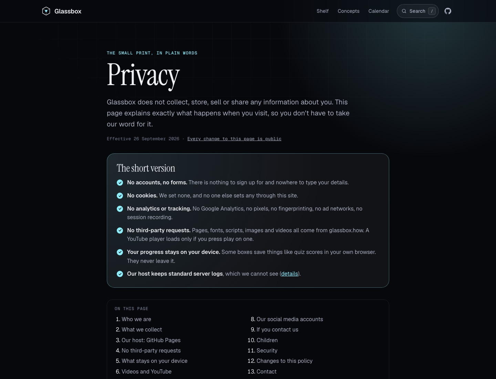

<p align="center"><a href="https://glassbox.how"></a></p>

<h1 align="center">Glassbox</h1>

<p align="center"><b>See inside how things work.</b><br>One open-source, interactive explainer every day: a model you can play with, a minute of plain words, a short video, and every line of code.</p>

<p align="center"><a href="https://glassbox.how"><b>glassbox.how</b></a> &nbsp;·&nbsp; <a href="https://youtube.com/@glassboxhow">YouTube</a> &nbsp;·&nbsp; <a href="https://instagram.com/glassbox.how">Instagram</a> &nbsp;·&nbsp; <a href="https://glassbox.how/feed.xml">RSS</a></p>

<p align="center">
  <a href="LICENSE"></a>
  <a href="LICENSE-CONTENT.md"></a>
  <a href="https://glassbox.how/privacy/"></a>
  
  
</p>

This repository is the **hub**. It holds the website at [glassbox.how](https://glassbox.how), the **studio** that turns a box into Reels, Shorts, a YouTube video, a carousel and captions, and the **publish kit** that schedules those through Buffer. Each box lives in [its own repository](https://github.com/glassboxhow?q=topic%3Aglassbox-box).

| | |
|---|---|
|  |  |
| **Home.** Today's box opens from a black box into glass; search anything with <kbd>/</kbd>. | **Explainer.** The question, the 40-second video, six plain-language beats, key terms, the code. |
|  |  |
| **Concepts A–Z.** Every term across every box, each linked to where you can see it working. | **Privacy.** Exactly what Google Analytics and ClickTrust see, why, and how to opt out. |

## Boxes so far

| No. | Question | Play | Code |
|---|---|---|---|
| 001 | How does a camera actually see? | [glassbox.how/cameraclear](https://glassbox.how/cameraclear/) | [glassboxhow/cameraclear](https://github.com/glassboxhow/cameraclear) |

The live list is [the shelf](https://glassbox.how/#shelf), built automatically from every public repo in the org tagged `glassbox-box`.

## How the pieces fit

```
github.com/glassboxhow                        glassbox.how
├─ glassboxhow.github.io  (this repo)  ──►  /                 home: today's box, the shelf, calendar
│    GitHub Actions builds it from     ──►  /e/<slug>/        explainer page for each box
│    every box's glassbox.json         ──►  /concepts/        every term, A to Z
│                                      ──►  /privacy/ /terms/
│                                      ──►  /studio/          recording + publish kit
├─ cameraclear            (No. 001)    ──►  /cameraclear/     the box itself
│    glassbox.json   the manifest           /cameraclear/glassbox/reel.mp4, slides, thumbnail…
│    glassbox/       studio output
└─ <tomorrow's box>       (No. 002)    ──►  /<slug>/
```

- **Every box is its own public repo** with GitHub Pages turned on. GitHub serves an org's project sites under the org site's custom domain, so `glassboxhow/cameraclear` appears at `glassbox.how/cameraclear/` with no proxy and no bill.
- **The hub finds boxes by topic.** Any public repo in the org tagged `glassbox-box` with a `glassbox.json` joins the shelf. The build runs every two hours, on every push, or straight away when a box's `notify-hub` workflow pings it.
- **Each box hosts its own media.** The studio writes the videos and images into the box's `glassbox/` folder, which keeps every repo far below GitHub's size limits. It also gives Buffer the public media URLs it needs.
- **Measured in the open.** Visits are counted with Google Analytics and bots detected with ClickTrust. Both load from one generated file, `/assets/analytics.js`, and nothing else is allowed. Fonts and libraries are self-hosted, and every page's Content Security Policy only permits our domain and those two services. There is no database and no account system. See [Privacy](https://glassbox.how/privacy/).
- **Zero npm dependencies.** The build, dev server and poster are plain Node 20. The site is plain HTML, CSS and JavaScript.

## The daily loop

```bash
npm run new -- <slug> "How does X work?" --field physics   # scaffold ../<slug> as the next box
npm run dev                                                # http://localhost:5210
```

1. **Build the model** in `../<slug>/app.js`, fill in `glassbox.json`, and write the storyboard (`window.glassbox.director`). The contract is in [docs/CONTRACT.md](docs/CONTRACT.md).
2. **Record** at `http://localhost:5210/studio/?box=<slug>`. You get a 16:9 video, a 9:16 Reel/Short, 10 carousel slides, a thumbnail, a share card and a clean still. It encodes in the browser (WebCodecs), faster than real time, with a generated soundtrack.
3. **Words:** edit the drafted captions for Instagram, YouTube, X and LinkedIn.
4. **Ship:** pick a time → **Save to repo** → **Dry run** → **Ship it**. That commits `glassbox/`, pushes it, waits for Pages to serve the files, then schedules every post in Buffer.
5. **First time only for a box:** `scripts/github-setup.sh <slug>` creates the public repo and fills in its description, homepage, topics, README, licences and Pages.

## What gets posted

| Target | Asset | Copy |
|---|---|---|
| Instagram Reel | `reel.mp4` (1080×1920) | Instagram caption |
| Instagram carousel (+4 h) | `slide-1…10.jpg` (1080×1350) | carousel caption |
| YouTube Short | `reel.mp4` | Short title and description |
| YouTube video | `video.mp4` (1920×1080) | long title and description |
| LinkedIn, X | `video.mp4` | LinkedIn / X copy |
| Threads, TikTok | `reel.mp4` | LinkedIn copy |

A target is skipped when no matching channel is connected in Buffer. Change the list in `glassbox.config.json`.

## Commands

| Command | What it does |
|---|---|
| `npm run dev` | Hub, every local box and the studio at :5210, laid out exactly like production |
| `npm run new -- <slug> "<question>" --field <f>` | Scaffold the next box from `templates/box` |
| `npm run check` | Validate local boxes: manifest, licences, CSP, no third-party requests, file sizes |
| `npm run readme -- <slug>` | Regenerate a box's README header, `LICENSE-CONTENT.md` and `package.json` metadata |
| `npm run build` | Static build to `dist/` from local boxes (`build:github` reads the org) |
| `npm run post -- <slug> [--dry\|--queue\|--now]` | Schedule a box in Buffer |
| `npm run post -- --channels` | List connected Buffer channels |
| `scripts/github-setup.sh hub\|<slug>` | Create or refresh the public repos, Pages, topics and metadata |

One-time setup (domain, org, Buffer): [docs/SETUP.md](docs/SETUP.md).

## Repository map

| Path | What |
|---|---|
| `site/` | Static assets: styles, search and cube script, `bar.js` (the pill inside every box), fonts, the studio |
| `scripts/lib/render.mjs` | Home, explainer, concepts, feed and sitemap pages |
| `scripts/lib/legal.mjs` | The privacy policy and terms (kept in sync with how the site actually works) |
| `scripts/lib/buffer.mjs` | Buffer GraphQL client: builds and schedules posts |
| `scripts/dev.mjs` | Local server mirroring production, plus the studio's save/ship endpoints (localhost only) |
| `templates/box/` | The starter every new box is made from |
| `.github/workflows/` | `pages.yml` builds and deploys the hub; `post.yml` posts a box from GitHub |

## Contributing

Found a mistake in an explainer, or want a box about something? See [CONTRIBUTING.md](CONTRIBUTING.md), or [suggest a box](https://github.com/glassboxhow/glassboxhow.github.io/issues/new?template=box-idea.yml). Security issues: [SECURITY.md](SECURITY.md).

## Licences

- **Code:** [MIT](LICENSE).
- **Words, images and videos** on the site and in this repo: [CC BY 4.0](LICENSE-CONTENT.md). Credit “Glassbox, glassbox.how”.
- **Third-party parts** keep their own licences: Geist and Instrument Serif fonts ([SIL OFL 1.1](site/assets/fonts/OFL.txt)), [mp4-muxer](site/studio/vendor/mp4-muxer.LICENSE) (MIT).
- The Glassbox name and cube logo aren't covered by either licence. See the [terms](https://glassbox.how/terms/).
